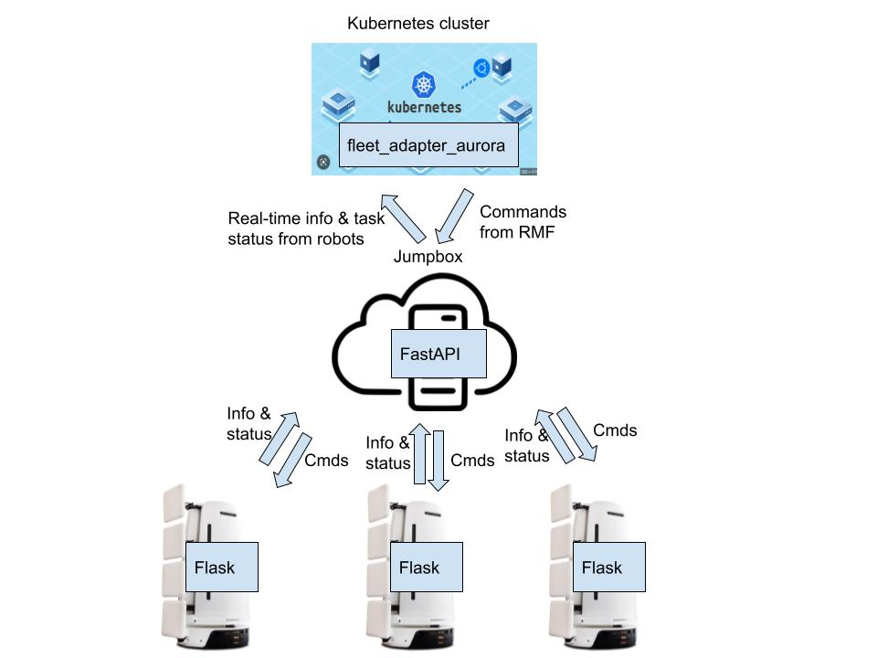

# AMR Integration
Senserbot Pte Ltd have at least 10 shelf reading robots being deployed at different national libraries in Singapore. However, those robots do not have the capabilities to take lift and move through the doors on themselves. Hence, in those situations, robots would require library staffs to joystick teleop them to different floors and move through the doors to reach the designated locations. With RMF in place, these issues could be resolved and human intervention is no longer required.

In this project, an Aurora robot that is meant for Punggul Regional Library was used to test with RMF. In order for RMF taking control of Aurora robot , it required a fleet adapter to be installed in a Kubernetes cluster and API endpoints to be available on the robot.

## Fleet Adapter
fleet_adapter_aurora was initially developed by referring to [fleet_adapter_template](https://github.com/open-rmf/fleet_adapter_template) and [fleet_adapter_ecobot](https://github.com/open-rmf/fleet_adapter_ecobot). As time passed by, there were some modifications and new logics being added to work seamlessly with Aurora robot.

In summmary, fleet_adapter_aurora does the followings:
1. Send different commands to Aurora robot.

    | Types | Purposes |
    |---------|---------|
    | Navigation commands | To navigate robot to certain waypoints on the map |
    | Docking commands | To trigger user-defined behaviors when robot is approaching  a waypoint that has "dock_name" being filled |
    | Action executor commands | To command robot to start custom actions eg. cleaning task and shelf reading task |

1. Request real-time information from Aurora robot such as robot pose and battery percentage. Will also query for task status when needed.




## Robot Modifications

Hardware:  
1. No hardware changes are required to work with RMF.

Software: 
1. Developed RESTful APIs with Python and Flask on Aurora robot.

1. Implemented in-house navigation method for robot to enter/exit lift such that robot can overcome the lift gap.

1. Implemented in-house task manager in the robot that is capable of adding new tasks, removing tasks and updating tasks based on the progress. and handles commands receiving from RMF as well.

## Learning Points

1. Self-defined long running functions that contain <code>self.lock</code> should be run inside threads so that update functions which also contain <code>self.lock</code> could be executed regularly without getting blocked. <code>thread.join()</code> must be avoided at all costs as well.

1. Whenever a threading.Event object is being checked for its boolean value, it is advisable to perform `event.wait(timeout=1)` just before the checking.<br>For example,

    ```python
    self._quit_path_event.wait(1.0)
    if self._quit_path_event.is_set():
        # to cancel existing navigation command running on the robot
    ```

1. Any user-defined navigation methods can be applied by making use of fleet adapter's <code>dock</code> behavior which is triggered whenever robot is approaching  a waypoint that has "dock_name" being filled through Traffic Editor GUI. The <code>dock</code> feature is being used to help Aurora robot overcome the lift gap when entering/exiting the lift at each floor and also to apply a specific docking mechanism to dock the robot at the charging station with the help of laser markers.

1. A python library called nudged was quite useful to find the coordinate transformation between floor plans of the environment that are needed by RMF and vendor-specific maps that are usually built by robots. The input is two sets of 2D points with 1 set coming from a floor plan and another set coming from its corresponding vendor-specific map.
 


