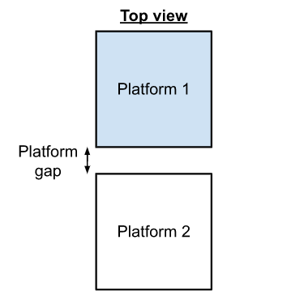
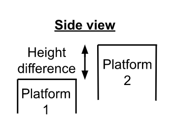
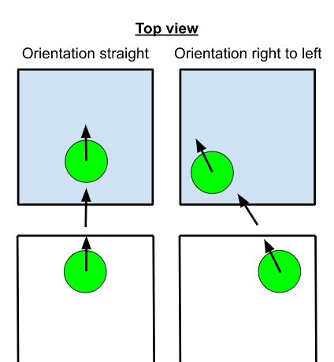
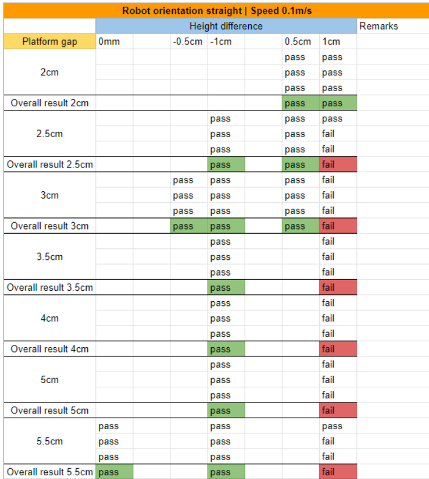
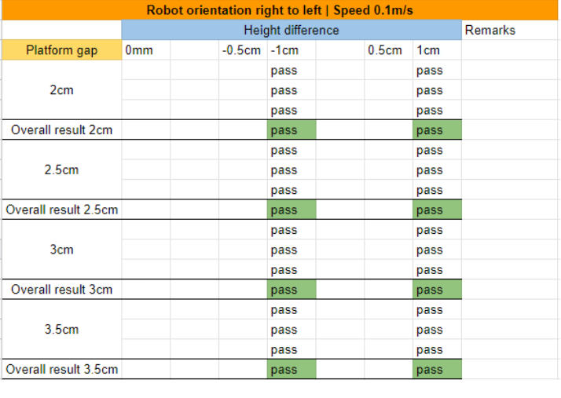
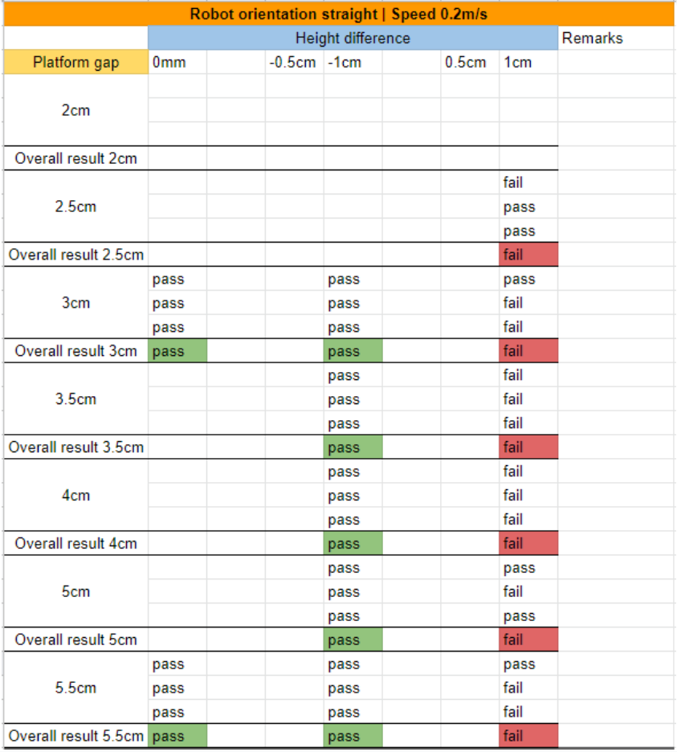
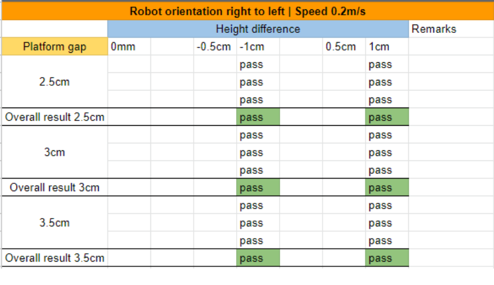
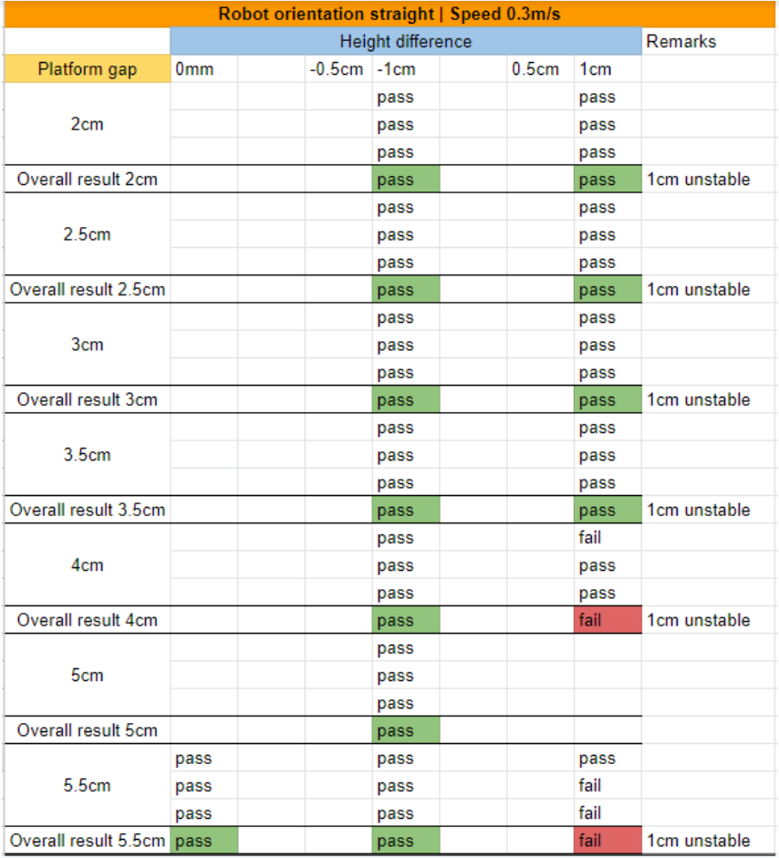
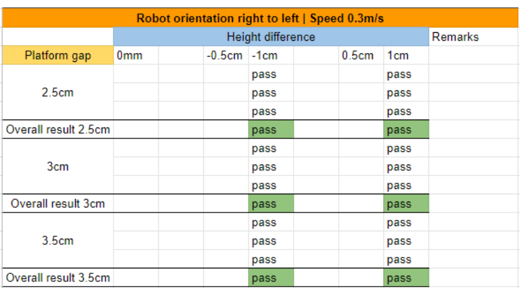

# Baseline 0

## Static Lift Rig Tests

### Objective

To find out under what conditions Senserbot’s Aurora robot	will be unable to cross the two platforms of the mock lift setup which are simulating the lift in the Tampines Regional Library (TRL).

### Variables
- Distance of the gap between the two platforms
- Height difference of the two platforms
- Positive value: to a higher platform | negative value: moving to a lower platform
- Robot speed while moving across the gap
- Robot orientation while moving across the gap

  
  <figcaption>Figure 1: Illustration of the distance between the two platforms</figcaption> 

  
  <figcaption>Figure 2: Illustration of the height difference between the two platforms</figcaption> 

  
  <figcaption>Figure 3: Illustration of the robot orientation while crossing the platform gap</figcaption> 

### Test Plan
- Pass if the robot is able to cross the platform gap, otherwise it is a fail
- Initial test: change 1 variable at a time and test 3 times for each configuration
- Use the results from the initial test to narrow down to the conditions that is a pass
- Repetitive test: test multiple times to check the reliability of the robot crossing the platform gap under the predetermined conditions

#### Initial test results

At speed 0.1 m/s,

  
  

At speed 0.2 m/s,

  
  

At speed 0.3 m/s,

  
  

#### Repetitive test results

|  |  |  |  |  |
|---|---|---|---|---|
| Horizontal gap | 2cm | 4cm | 3cm | 3cm |
| Vertical height | 1cm | 1cm | 0.5cm | 1cm |
| Speed | 0.1m/s | 0.1m/s | 0.1m/s | 0.1m/s |
| Orientation | Straight | Straight | Straight | Diagonal |
| Success rate | 3/10 | 46/50 | 50/50 | 10/10 |
| Percentage | 30% | 92% | 100% | 100% | 