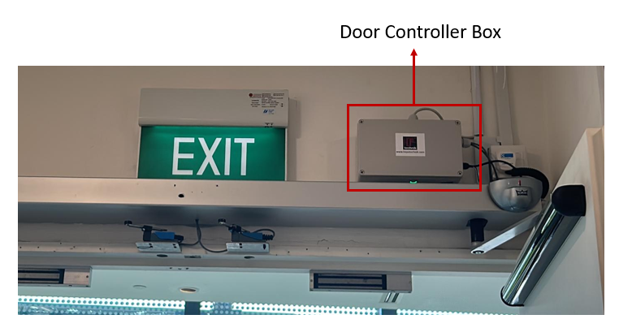
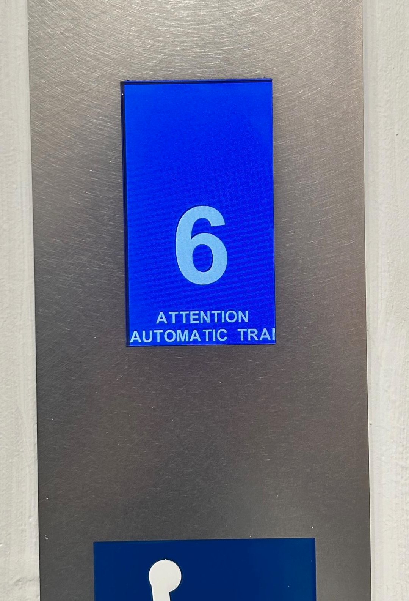

# Lift and Doors Integration

## Overall System Overview

The objective of lift and doors integration with RMF (Robotics
Middleware Framework) is to facilitate infrastructure interoperability
with the deployed robots in the building.

A physical server, a lift controller box for the service lift and 5 door
controllers for doors on levels 2 through 6 are installed on site to
achieve the aforementioned objective. Refer to figure 1 to get an
overview of the overall architecture.

 
     
    <em>Figure 1: Physical system architecture.</em>

The server is located at the library's network/server room and it
communicates to RMF via AWSCore/MQTT. A PLC is housed in a lift controller
box at level 6 cargo lift lobby, which is shown in figure 2. It is
connected to the server via LAN/Ethernet.

 
     
    <em>Figure 2: Lift Controller Box installed on-site (front and side views)</em>

A controller box was installed for each door to control its movement, as
shown in figure 3. The controller box interfaces with the door\'s
internal circuit (pre-installed automated door controller) and motion
sensor as well as its security card access system. An IO acquisition
module is housed in each controller box which is connected to the server
via LAN/Ethernet cable.

 
     
    <em>Figure 3: Door Controller Box installed on-site</em>

With regards to the particular communication protocol between each
hardware component, RMF communicates to the infrastructure via a ROS2-AWSCore/MQTT bridge. RMF sends
a LiftRequest.msg to AWSCore to command the lift while it receives
LiftState.msg as lift's status update at a frequency of 1 Hz. Similarly
for doors, with DoorRequest.msg and DoorState.msg.

Server parses a LiftRequest message and sends relevant commands to a
PLC (Programmable Logic Controller) via ADS communication protocol
which is then forwarded to the lift by manipulating corresponding
signals via dry contact. Beckhoff CX9020 was the PLC model used for this
project. It is connected to four digital input terminals and six digital
output terminals.

Similarly, the server parses a DoorRequest message and sends relevant
commands to the IO module via RESTful API, which then directly interacts
with the pre-installed automated door controller via installed electronics. Adam
6052 was the IO acquisition module used for this project.

The following sections explore each component in detail.

# Integration with Lift
## AGV Mode

To facilitate the project's operations, the lift vendor upgraded the
installed lift to accommodate a new mode of operation called AGV mode.
Under this mode of operation, it allowed external hardware to interface
with its internal circuit and control the lift movements.

All new hall calls (buttons pressed from lobby to call lift to that
particular floor) and car calls (floor number buttons pressed from
within lift) are ignored in this mode. Before transitioning into AGV
mode from human/manual mode, all the existing car calls are completed to
ensure passengers already onboard the lift are allowed to get off at
their intended destination floor whereas hall calls are cancelled. This
mode is displayed in the elevator user interface panel as shown in
figure 4 and the same is announced from the speaker as well.

 
     
    <em>Figure 4: The following message: "ATTENTION AUTOMATIC TRANSPORT OPERATION" is shown on all car and hall lift displays.</em>

## Flow of operations

The standard flow of operations is as follows (with respect to lift
controller): 

1. Particular input signals are activated if the lift is in
normal, working condition to transition into AGV mode.
2. After lift finishes existing car calls, it switches to AGV mode. Lift then moves to
the destination floor as requested.
3. After a successful transit, it stays at the same floor with its doors kept open until a new command is received.
4. It exits AGV mode to get to human/manual mode after the robot has finished its transit.

At a particular floor, a specific signal ensures that lift doors are
open to facilitate robot movement into the lift car. After receiving a
signal to move to another floor, the lift doors are automatically
closed.

 
     
    <em>Figure 5: Lift in AGV mode at floor 6 with its doors kept open.</em>

The lift is connected directly to the building's fire alarm signal and
alerts PLC consequently. Lift immediately exits AGV mode (PLC goes into
error state) and proceeds to the first floor and keeps its doors open.
The alarm beacon on top of lift controller box (refer to figure 6) is
enabled which lights up as a red light to alert the nearby patrons and
library staff of the emergency situation.

If the PLC is in error state, all requests are ignored until the
recovery behaviour has been implemented. At the end of this section, all the
possible exception scenarios are listed in more detail.

Please note that as per project requirements, floor B1 is currently
excluded from the operational flow and lift controller box cannot
command the lift to reach it. This can be easily modified later if
needed by making corresponding changes in the lift controller box
hardware and software.

## Lift Controller Box

 
     
    <em>Figure 6: Lift Controller Box with respect to the physical system architecture.</em>

Lift controller box is installed at the sixth floor in the service lift
4 lobby of the library. It looks as shown in figure 6, with different
external components labelled in the image. A conceptual diagram with the
box's contents and its connections to external peripherals and devices
is shown in figure 7.

A turnkey slot is provided to facilitate the library staff to disable or
enable the AGV mode option. If it is toggled towards the Manual mode
option, lift will remain in manual mode and all RMF requests to switch
to AGV mode will be ignored.

A Simulated Fire Alarm button is included to mimic an actual fire alarm.
Its main purpose is to help in the testing of fire alarm exception case
and serves no purpose after deployment. In both simulated and actual
fire, the alarm sound beacon sounds and lights up to alert the nearby
patrons and staff of the emergency.

 
     
    <em>Figure 7: Labelled lift controller box.</em>

 
     
    <em>Figure 8: Conceptual connections diagram of the lift controller box.</em>

# Integration with Doors
## Flow of Operations

The standard flow of operations is quite straightforward (with respect
to the door controller): 
1. If the door controller is not offline, either
open/close command is received and the door is respectively actuated.
2. In open command, the door is kept open until explicitly commanded
otherwise.
3. If the door controller is offline, all requests are ignored
until it is back online.

## Door Controller Box

 
     
    <em>Figure 9: Door Controller Boxes with respect to the physical system architecture.</em>

Each door has its own door controller box, so there are 5 such boxes
installed on levels 2 through 6. It looks as shown in figure 10, with
different external components labelled in the image. A conceptual
diagram with the box's contents and its connections to external
peripherals and devices is shown in figure 11.

 
     
    <em>Figure 10: Labelled door controller box.</em>

 
     
    <em>Figure 11: Conceptual connections diagram of the door controller box.</em>

The limit switches are used as feedback to confirm if the door has
'fully closed'. The pre-installed automated door controller's internal
circuit is utilised to confirm if the door has 'fully opened'.

# Server

 
     
    <em>Figure 12: Server with respect to the physical system architecture.</em>

The application is deployed via a Docker container. It utilises AWS IOT
Core cloud service to connect to the RMF lift adapter.

 
     
    <em>Figure 13: Software Architecture of server application.</em>

A LiftState message is published to the AWS topic every 2 seconds which is
read by RMF to get all relevant information about the lift state at that
instance. The contents of the message is shown in figure 14. 

 
     
    <em>Figure 14: ListState.msg contents.</em>

The data to be published is retrieved via the PLC using ADS (Automation
Device Specification) communication protocol, which is Beckhoff's
preferred method.

RMF commands the lift by publishing a LiftRequest msg every 1 second on
a unique AWS topic which the server subscribes to. The contents of
the message is shown in figure 15. 

 
     
    <em>Figure 15: LiftRequest.msg contents.</em>

A DoorState msg for each door is published to the respective AWS topic
every 2 seconds which is read by RMF to get all relevant information
about the door state at that instance. The contents of the message is
shown in figure 16. 

 
     
    <em>Figure 16: DoorState.msg contents.</em>

RMF commands each door by publishing a DoorRequest msg every 1 second on
an AWS topic which the server subscribes to. This topic is the same for
all doors. The contents of the message is shown in figure 17. 

 
     
    <em>Figure 17: DoorRequest.msg contents.</em>

# Exception Scenarios

The following subsections explore all possible exception cases for lift
and doors and their respective recovery behaviours. The application is
built in a non-blocking way, for example, if one door has error or is
offline, other doors and lift are unaffected and vice-versa.

## Lift Exceptions and Recovery Behaviour

Table 1 summarises the exception scenarios possible with regards to the
lift and its controller box. It also specifies the corresponding
recovery behaviour to handle the occurred exception.

Table 1: Exception Scenarios for service lift

|             |                                                                                          |                                                                                                                 |                                                                                                                            |
| ----------- | ---------------------------------------------------------------------------------------- | --------------------------------------------------------------------------------------------------------------- | -------------------------------------------------------------------------------------------------------------------------- |
| **Sr. No.** | **Error/Exception**                                                                      | **Action**                                                                                                      | **Recovery behaviour**                                                                                                     |
| 1           | Loss of communications between   server and PLC.                                     | 1. Lift goes back to manual mode.   2. PLC state goes to error state.                                       | When the heartbeat is heard again, it goes   back to human mode. No need for human   intervention.                 |
| 2           | Fire Alarm is activated.                                                                 | 1. Lift goes back to manual mode.   2. PLC state goes to error state.  3. Sound beacon is switched on.  | Manual intervention is needed. PLC will stay in   error state until it is restarted.                                   |
| 3           | Lift is not in operational state.                                                        | 1. Lift goes back to manual mode.   2. PLC state goes to error state.                                       | No need for human intervention. Operations   will continue as they were after lift is back in   operational state. |
| 4           | Simulated Fire Alarm button is   pressed.                                            | 1. Lift goes back to manual mode.   2. PLC state goes to error state.   3. Alarm beacon is switched on. | Manual intervention is needed. PLC will stay in   error state until it is restarted.                                   |
| 5           | If turnkey is toggled towards   Manual                                               | 1. Lift goes back to manual mode.  2. PLC state goes to error state                                         | To return things to normal, toggle turnkey   towards AGV mode.                                                         |
| 6           | Mode Timeout (10 minutes) (Lift is unable to go to AGV   mode from human mode)   | 1. Lift goes back to manual mode.  2. PLC state goes to error state.                                        | Manual intervention is needed. PLC will stay in   error state until it is restarted.                                   |
| 7           | Destination floor requested is   not in available floors                             | 1. Lift goes back to manual mode.                                                                               | Operations flow is not hampered. RMF to send   a correct destination floor in the next request.                        |
| 8           | Lift movement timeout -   Lift did not reach destination   floor after 2 minutes | 1. Lift goes back to manual mode.  2 . PLC state goes to error state.                                       | Manual intervention is needed. PLC will stay in   error state until it is restarted.                                   |

If PLC goes into error state, it is indicated by the last LED on its
output terminal, as shown in figure 18:

 
     
    <em>Figure 18: Error state indication by LED on PLC, encircled by red ellipse.</em>

## Door Exceptions and Recovery Behaviour

Table 2 summarises the exception scenarios possible with regards to the
lift and its controller box. It also specifies the corresponding
recovery behaviour to handle the occurred exception.

Table 2: Exception Scenarios for doors

|             |                                                            |                                         |                                                                                                                              |
| ----------- | ---------------------------------------------------------- | --------------------------------------- | ---------------------------------------------------------------------------------------------------------------------------- |
| **Sr. No.** | **Error/Exception**                                        | **Action**                              | **Recovery behaviour**                                                                                                       |
| 1           | Loss of communications between server and door controller. | 1. Door mode is reflected as ‘offline’. | Need for human intervention if it stays disconnected for a long time. After reconnection, the operation continues as before. |
| 2           | Cannot detect fully open or fully closed door state.       | \-                                      | Need for manual intervention to fix the relevant sensor.                                                                     |
