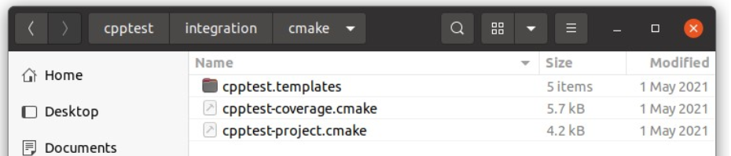
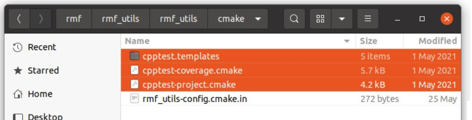

# Parasoft Setup (of RMF)

In this section, we will go through an example of configuring the [rmf_utils](https://github.com/open-rmf/rmf_utils) package to be suitable
for running Parasoft tests on it.

##  Setting Up Parasoft  
As our current license is only supported on one local machine, the Machine ID has to be fixed to a
non-floating one each time a new Parasoft session is being started.
Fix the machine ID with the following command:
> export PARASOFT_SUPPORT_NET_INTERFACES=enp5s0  

Now that the Machine ID is a non-floating one, we can now run the Parasoft software with:  

> <PARASOFT_INSTALL_DIR>/cpptest

##  Configuring rmf_utils Project  
To import existing projects on Parasoft to run testings, we need to perform the following actions:
- Add the Parasoft cmake folder into rmf_utils project structure
- Add configuration lines into the main CMakeList.txt
- Build the rmf_utils project

##  Add Parasoft Cmake Folder  
From /$PARASOFT_INSTALL_DIR/integration/cmake directory, copy the entire Parasoft cmake
folder into rmf_utils project structure.


This cmake folder consists of "cpptest.templates", "cpptest-coverage.cmake" and "cpptestproject.cmake".



The entire Parasoft cmake folder is now added into rmf_utils project structure.



##  Add Configuration Lines into Main CMakeList.txt:

To enable the cmake folder with Parasoft C/C++test related extension functions, we need to add the
following line:
> include(cmake/cpptest-project.cmake)  

We will need to define a target to represent the C/C++test project for rmf_utils, by adding  
cpptest_add_executable() function and other required build options and dependencies:

```
cpptest_add_executable(
rmf_utils_testing              # name of C/C++test project name (to be modified)
CPPTEST_COMPILER_ID gcc_9-64   # compiler name
TARGETS mf_utils               # target name (to be modified)
)

# link C/C++test project name to target name
target_link_libraries(rmf_utils_testing PRIVATE rmf_utils)		
```

##  Build rmf_utils Project:  
Now that the target is defined with build options and dependencies, we can now configure and build
to generate C/C++test project configuration files for rmf_utils. This allows us to import rmf_utils as
an Eclipse project in Parasoft. This is done by the following commands:

```
cd <RMF_UTILS_DIRECTORY>
mkdir build
cd build
cmake -DCPPTEST_PROJECT=ON ..
make
```

##  Importing rmf_utils Projects  
After configuring the project, we can now proceed to import it into Parasoft. On the Parasoft
window, navigate to the following tab:
> File > Import > General > Existing Projects into Workspace

Select "root directory" to be the main folder, and browse for the rmf_utils project.
Under Options subcategory, select "search for nested projects" checkbox. A list of C/C++test
project names would be listed according to the rmf_utils project.
Select the corresponding C/C++test project name, rmf_utils_testing in this tutorial, configured in
the cpptest_add_executable() previously.
Lastly, click Finish to import rmf_utils project.


##  Running the Parasoft Test

Now that we have imported rmf_utils successfully into Parasoft, we can now run tests according to
our preferred rules and standards.
Select the imported project, rmf_utils_testing, on the left panel. Click on the blue Run Tests button
to test the project using the default "Recommended Rules" standard.  


We can choose other standards to run the test, by clicking on the arrow beside the blue Run Tests button.
Customization can be done as well by navigating to the following tab:
> Parasoft > Test Configurations

Select the desired rule category > Static.
Select or deselect rules to customize.
Click Apply to save changes.


The sample html parasoft report pf the [rmf_utils](https://github.com/open-rmf/rmf_utils) package can be accessed 
in the [Parasoft Outputs](./parasoft-outputs.md) section of this handbook


