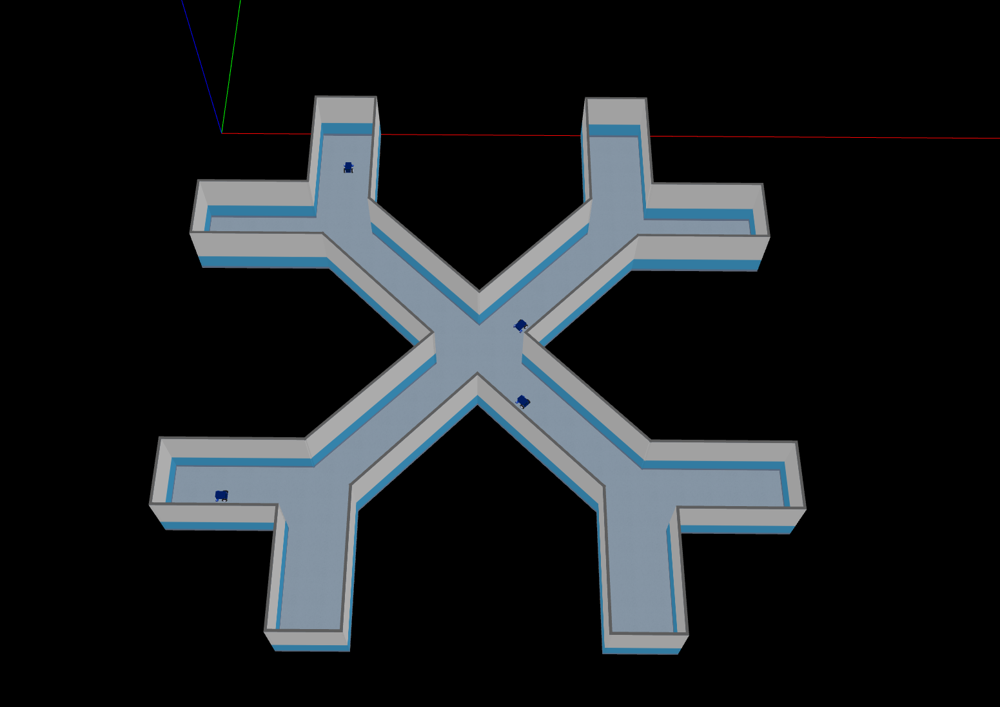

# Standalone Tests
1. [Introduction](#introduction)
3. [Summary of Test Results](#summary)

## Introduction 
To stress test the RMF scheduler the [demo Battle Royale](https://github.com/open-rmf/rmf_demos/#battle-royale-scenario) scenario was used.

The battle royale demo includes an X crossing with four robots that are told to loop between two opposite points, requiring each robot to share a corridor with another robot and the junction with three other robots.

## Summary of Test Results 

The test was left to run overnight and throughout the project some stability issues leading to robot deadlocks were identified. In-depth debugging and updates to the scheduler were pushed as part of this deployment that increased the reliability until overnight stress tests were successful. The changes introduced can be seen in the [rmf_internal_msgs](https://github.com/open-rmf/rmf_internal_msgs/pull/45), [rmf_ros2](https://github.com/open-rmf/rmf_ros2/pull/228), [rmf_traffic](https://github.com/open-rmf/rmf_traffic/pull/86) and [rmf_demos](https://github.com/open-rmf/rmf_demos/pull/157) pull requests.
Specifically, the RMF scheduler makes extensive use of parallel and asynchronous behavior to operate as fast and efficiently as possible. Several edge cases of the scheduler behaving incorrectly when for example fleets submitted bad estimates for their tasks, or fleet adapter responses were sent in the wrong order to the scheduler.
