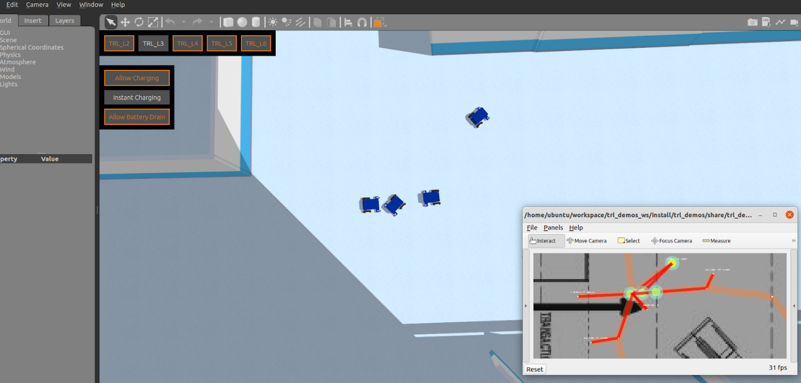

# Standalone Test Videos
1. [Introduction](#introduction)
   1. [Standalone Test 1](#standalone1)
   2. [Standalone Test 2](#basic2)
   3. [Standalone Test 3](#basic3)
2. [Summary of Test Results](#summary)

## Introduction 
Below are a series of tests that identify the breaking points of the RMF scheduler. The tests were conducted in TRL world, similar to that of [basic tests](basic-tests.md). However, the robot lanes in these tests were engineered specifically to find the limits of the RMF scheduler. Hence there will spawning of multiple robots in close proximity which are only for the sake of this stress testing.

These tests were conducted using a [script](https://github.com/TRL-RMF/trl/blob/main/standalone_tests/standalone_tests.py) which sends out RMF commands/tasks at pre-defined intervals. 

The results are shown in the gifs/videos below.

## Standalone Test 1 : Navigation path de-conflicting 
4 robots are spawned in simulation.
At a predefined time interval (e.g. 30 seconds), 2 of the robots will be commanded to move to each other’s position (dispatch_loop task).

The 2 robots are expected to resolve their paths by using the holding point/making way.
The gif below shows the RMF scheduler working as intended.

However, when too many tasks are being sent too quickly, we observe RMF stalling, being unable to resolve paths (as shown in the red lines on Rviz, indicating a navigation path is unable to be resolved).

Upon investigation, it was found that even when there is a robot1 occupying a destination waypoint of another robot2, the task will still be sent to robot2. Robot2 will still navigate until the very last waypoint before the destination waypoint before realizing that the last (destination) waypoint is occupied by robot1 and there is no way to reach its destination (and hence no way to resolve it's navigation path).

This has been brought up to OSRC and there are currently discussions involving a "reservation system" for waypoints.

## Standalone Test 2 : Navigation path de-conflicting with door   
3 robots are spawned near a door.
At a predefined time interval (e.g. 30 seconds), 2 of the robots will be commanded to move to each other’s position (dispatch_loop task) through the door.
The 2 robots are expected to resolve their paths by using the holding point/making way.
The gif below shows the RMF scheduler working as intended.

What was observed at times, however, was that the robot did not make use of the holding point, and instead used the lift cabin as the holding point while waiting for other robots to pass as shown below.

This was attributed to a design fault when designing the TRL world in traffic editor. System integrators must take note to mark certain areas as being unable to “hold” robots.

## Standalone Test 3 : Navigation path de-conflicting with lift   
5 robots are spawned on each floor, near the lift lobby.
At a predefined time interval (e.g. 30 seconds), 2 of the robots will be commanded to move to each other’s position (dispatch_loop task) using the lift.
The 2 robots are expected to wait for the other to use the lift cabin, as only one robot can occupy it at a time.
The gif below shows the RMF scheduler working as intended.

In the above video, we see the 2nd robot waiting outside the doors for the other robot to take it's place, before entering back into the lift cabin and going down to its destination.

What was observed at times, however, was that the robot does not give way to the other robot leaving the lift as shown below.

This is similar to standalone test 1, except the problem can also be attributed to the lift. The lift only detects that the lift is empty after the robot has left the lift cabin and reached the first waypoint outside the lift. Hence, RMF stalls because the robot is unable to reach that first waypoint outside the lift and the lift is also unable to move. 

This issue has also been raised up to OSRC.