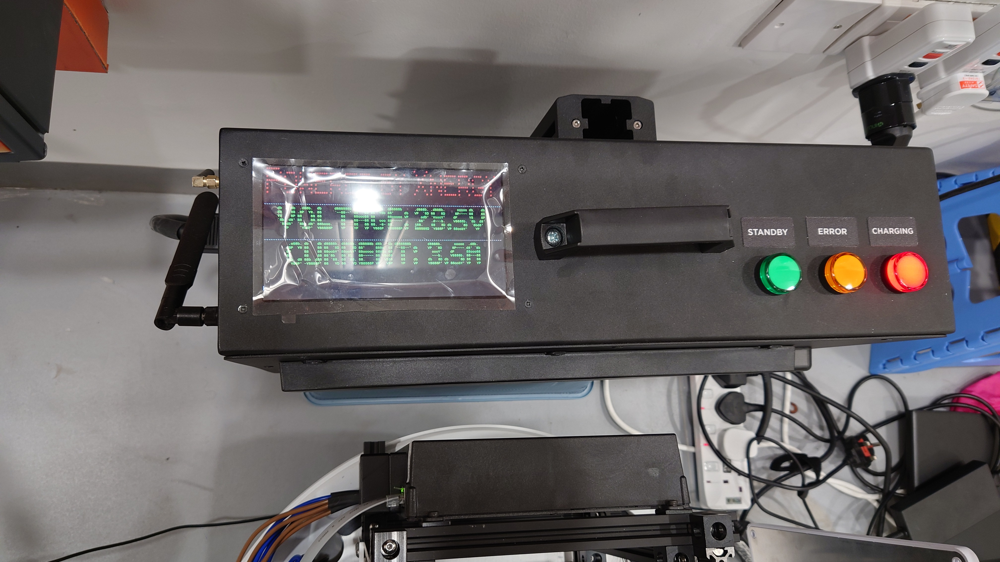

# Xnergy Wireless Charger

Robot vendors typically provide dedicated chargers for their robots. The charger of each vendor could be different in term of size, shape, voltage output and charging protocols and it is quite rarely that robots from different vendors can share the same charging facility. Therefore, customers have to purchase at least one charger for each robot type and allocate an enough space for each charger which could eventually take up alot of space. However, the issue can be rectified by using the wireless chargers made by Xnergy.

Xnergy is a Venture and Sovereign-backed startup in Singapore that pioneers leading wireless technology in the areas of AGV, Robotics and EV applications globally. The startup's Universal Contactless charging technology works as one charger for all robots that run on any batteries. Along with its generous air gap tolerance and small foot print, it allows for non-precision docking and easy integration into both legacy and modernised fleets. Coupled with its fast charging capability, Xnergy’s Universal Contactless Charger significantly improves robots’ uptime at a fraction of the cost.

<div align="center">
  
  <figcaption>Figure 1: Xnergy’s One-charger-for-all mobile robots</figcaption><br>
</div>

## Key Product Facts

- Suitable for any battery powered vehicles
- Large Voltage Range: 16V to 60V
- Easy Installation
- Small size: 20x20cm
- Light weight: 1-2.3kg
- Large airgap: 2-7cm
- Support all battery types 
- CE certification by TÜV SÜD


## Recommended integration to AMR  

The integration of Xnergy Wireless Charger was straightforward as it only requires a USB to ethernet adapter for Modbus communication, a cable to transfer power from the receiver unit to the robot's charging port and a structure to mount the receiver unit onto the robot.

### Mechanical placement consideration

Wireless charger's receiver unit was mounted on the edge of the robot for it to be closer to the transmitter unit so that robot could receive the maximum energy transmission. 

<div align="center">
  
  <figcaption>Figure 2: Receiver unit mounted on the edge of Aurora robot</figcaption><br>
</div>


### Software

[Xnergy RCU ROS driver](https://gitlab.com/zhanglongqi/xnergy-charger-rcu) must be installed on the robot in order to use the wireless charger. The ROS driver facilitates communication with the Receiver Unit (RCU) mounted on the robot via Modbus, CANbus, or GPIO.

#### Step 1 - Create catkin workspace and clone repository
```shell
mkdir -p catkin_ws/src/xnergy_charger_rcu
git clone https://gitlab.com/zhanglongqi/xnergy-charger-rcu.git catkin_ws/src/xnergy_charger_rcu
```
#### Step 2 - Install Python dependencies and build
```shell
pip3 install -r catkin_ws/src/xnergy_charger_rcu/requirements.txt
cd catkin_ws
catkin_make
source devel/setup.bash
```
#### Step 3 - start up a Xnergy Charger RCU Node
**Modbus**:

```shell
roslaunch xnergy_charger_rcu xnergy_charger_modbus.launch
```

or with argument

```shell
roslaunch xnergy_charger_rcu xnergy_charger_modbus.launch device:="/dev/ttyRCU"
```

**CANbus**:

```shell
roslaunch xnergy_charger_rcu xnergy_charger_canbus.launch
```

**GPIO**:

```shell
roslaunch xnergy_charger_rcu xnergy_charger_gpio.launch
```
### Functional Checks

| Check item | Passed/Failed |
|---------|---------|
| Charges a 24V robot battery | Passed |
| Charges the battery continuously for 30 minutes | Passed |
| Allows 2-7cm air gap between transmitter and receiver unit | Passed |

<br/>
<div align="center">
  
  <figcaption>Figure 3: Robot was charging using Xnergy wireless charger</figcaption><br>
</div>


## Docking approaches

Aurora robot was able to dock to wireless charger with help of reflective markers and an in-house docking algorithm. The two reflective markers were pasted slightly below the charger at the height that lidar sensor can see as shown in Figure 4. The high intensity readings from lidar reflect where the markers are with respect to robot footprint and the information could guide robot to move closer to the charger and eventually stop at a pre-defined distance. After that, robot is programmed to trigger a ROS service to start the wireless charging.

<div align="center">
  
  <figcaption>Figure 4: Robot docks with the help of reflective markers</figcaption><br>
</div>


