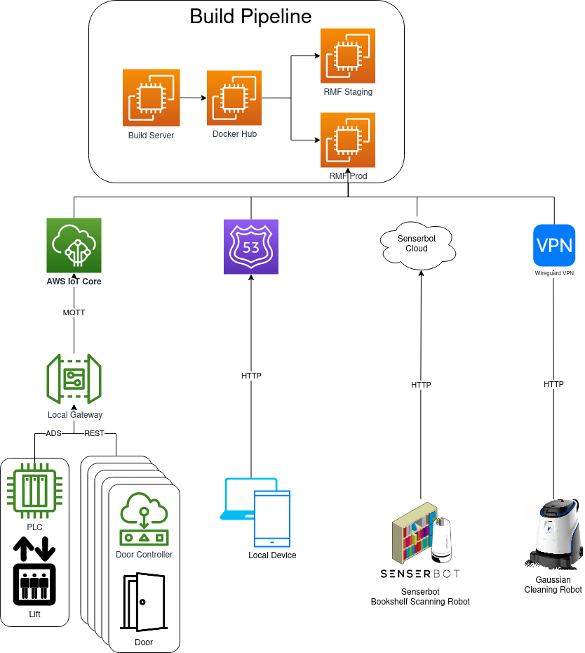

# Project Outline

## Requirements

The requirements were gathered first through user interviews with the NLB staff as well as discussions with S&TPPO. The team has distilled the requirements into the below points:

1. The system should be able to autonomously run with no active human monitoring.
2. The system should be able to autonomously run with minimal human intervention for fault handling.
3. The system should share infrastructure across different vendors to reduce duplication and resource consumption.
4. The system should be proven to be robust and reliable. GovTech established that this is 95% success rate of tasks issued.
5. The system should be modular, and highly scalable.
6. The system should be safe.

It is noted that cybersecurity was not a primary consideration. This can be attributed to the fact that in the event of system failure due to malicious efforts, the impact to the NLB agency was minimal, as bookshelf scanning and cleaning did not immediately affect the agency's ability to provide the service to citizens. Thus, granting GovTech time to respond to such incidences and reinstate the system. Furthermore, as there was no sensitive data stored within the system, and the system is a backend system that is transparent to the citizens, the impact to the agency or nation was trivial.

## Test Centric Approach

Based on the requirements, the test plan was derived to prove that the system has met these requirements:
1. Single Robot using automated door and lift to perform task on a different level with no human intervention. (Requirements #1,2,3,4).
2. Single Robot using common charging points. (Requirements #3).
3. Single Robot parking in designated safety spots during fire alarm. (#Requirements #6).
4. Two Robots from different brands able to deconflict lift and door use to perform respective tasks. (Requirements #1,2,3,4).

With regards to Requirement #5, that is a design choice that GovTech and its vendors will adopt when implementing a system. There is no one way to test whether we have achieved this but through future deployments, in terms of review of effort from the scale-up team. However, one way to track this metric quantitatively could be through the cost associated with the next deplyoment of RMF within a NLB premise. Preliminary costing for Punggol Regional Library RMF Deployment is at about $100,000, which is approximately 90% cost reduction of the initial deployment at TRL.

## Readiness Assessment

These tests were then performed and is detailed within the test section. The UAT and the randomized testing helped determine how ready the system is for deployment, surface bugs for remediation and determine the ConOps for NLB.

# Overall Architecture

# Our partners and contributors

<!DOCTYPE html>
<html>
<head>

</head>
<body>

<!--- -->
<!--- -->

<!--- -->

<!--- -->

  

    
  

  

    
  

  

    
  

   

## Project Sponsor

Mr Chong Teng Sheng  - S&TPPO   
Project Sponsor  
<chong_teng_sheng@pmo.gov.sg>
  
## Project Collaborators
  
Mr Abilash Sivalingam  
<abilash_sivalingam@tech.gov.sg>   

Mr Selvavignesh Balasubramanian  
<balasubramanian_selvavignesh@tech.gov.sg> 

## RMF Overall Systems Integrator & Building Management Systems Integrator  
Mr Lim Joo Siang - PM, Hope Technik   
Overall Systems Integrator Lead & RMF Building Management Systems  
<limjoosiang@hopetechnik.com>  

## RMF Core & Fleet Systems Integrator  
Dr Ho Chin Keong - CTO, Senserbot  
RMF Core Integrator Lead  
<ChinKeong@senserbot.com>  

    
Mr Matt Festo - PM, OSRF Singapore   
<matthew@openrobotics.org>  

   
Dr Michael Grey - Lead Developer, OSRF Singapore    
RMF Scheduler Development Lead    
<grey@openrobotics.org>     

## Universal Wireless Charger Systems Integrator  
Mr Terrenlzze Wong - Xnergy Wireless
Wireless Charger Lead    
<twongms@xnergytech.com>    

</body>
</html>			
